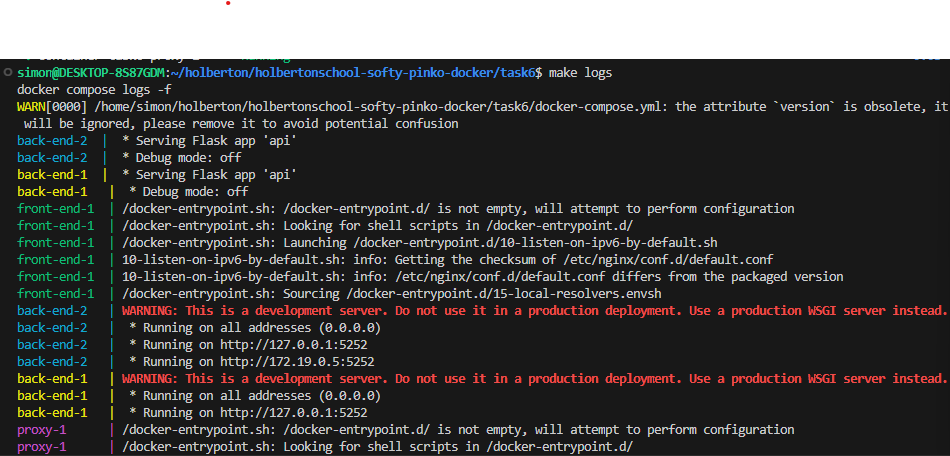

# Task6 - Scale Horizontally

This task demonstrates **horizontal scaling** of the back-end API using **Docker Compose**.  
Instead of running a single API container, we can scale to **multiple replicas** to handle more traffic.  
The proxy (Nginx) automatically load-balances requests between them using a **round-robin** algorithm.

---

## Project Structure

task6/
- back-end/ (Flask API)
- front-end/ (Nginx static site)
- proxy/ (Nginx proxy server)
- docker-compose.yml
- Makefile
- 2-api-servers.txt
- images/
  - screen.png (screenshot of logs)

---

## Docker Compose

### docker-compose.yml
- **back-end**
  - Flask API
  - Exposes port `5252` internally (not mapped to host)
- **front-end**
  - Nginx static files
  - Exposes port `9000` internally (not mapped to host)
- **proxy**
  - Nginx proxy server
  - Maps host port `80` → container port `80`
  - Routes:
    - `/` → `front-end:9000`
    - `/api` → `back-end:5252`
- Uses `depends_on` to ensure services start in order.

---

## Scaling the Back-end

With Docker Compose, scaling is a single command.  
We also save this command in a file named **`2-api-servers.txt`** (required by the checker):

```txt
docker compose up --scale back-end=2 -d
```

To simplify the exercise, this command is also integrated directly into the Makefile under the target `scale`.
This way, instead of typing the full Docker Compose command, you can simply run:

```bash
make scale
```

and the application will start with 2 back-end replicas automatically.

## Makefile

To simplify usage, the root Makefile includes:

```bash
make build      # Build all images
make up         # Start all services
make scale      # Start all services with 2 back-end replicas
make logs       # View logs from all containers
make ps         # List running containers
make down       # Stop and remove all containers
```

## Verifications (logs)

After running `make scale`, checks logs whit:

```bash
make logs
```

Both back-end-1 and back-end-2 should start and handle requests:



## Notes

- The proxy ensures clients only need to know `http://localhost`
- Front-end and back-end are hidden from direct external access.
- Scaling can go beyond 2 containers (e.g., `--scale back-end=5`).
- This is the foundation for load balancing in production.
